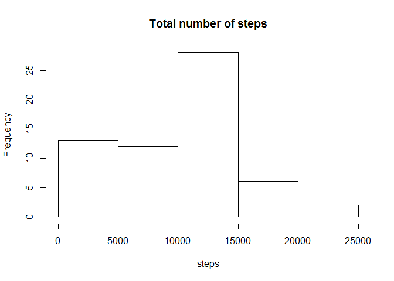
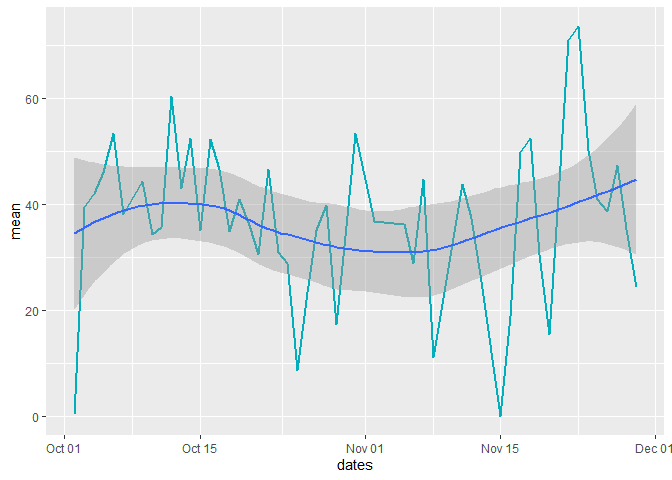
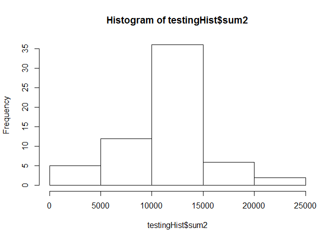
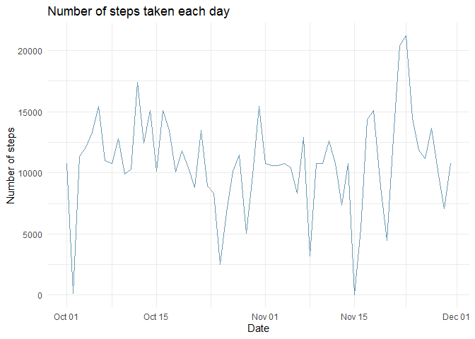
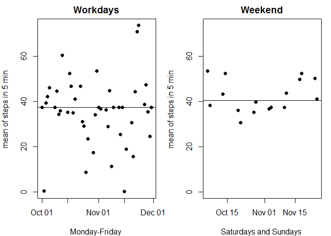

This is my take on the R project, be easy on me, some of my variables names should be more recognizable(I mean logicaly named, I wouldn'd do this in a data-world, and somewhere I brought tedious coding without the %>% statements which could shorten the code altogether)

The first task is following

1. Code for reading in the dataset and/or processing the data
#this is solved by read.csv , dataframe is pretty normal and tidy,
#just needs tidying by data and managment of NA values, this is apsolv
First we load the data and use summary to inspect the NA values


```r
setwd("E:/ljubi/edukacija/Coursera/John Hopkins - Data Science Specialization/Reproducible research")
list.files()
```

```
##  [1] "activity.csv"                "CopyOfPA1_template.html"    
##  [3] "CopyOfPA1_template.md"       "disposition - new.R"        
##  [5] "disposition.R"               "git.R"                      
##  [7] "hehetest.Rmd"                "Newtemplate.html"           
##  [9] "Newtemplate.md"              "Newtemplate.Rmd"            
## [11] "PA1_template"                "PA1_template.html"          
## [13] "PA1_template_files"          "R_template_new"             
## [15] "repdata_data_activity.zip"   "RepData_PeerAssessment1"    
## [17] "RepData_PeerAssessment2"     "Reproducible research.Rproj"
## [19] "Research"                    "test1.R"                    
## [21] "test3.r"                     "testing function.R"         
## [23] "testmarkdown.html"           "testmarkdown.Rmd"           
## [25] "testmarkdown_files"          "testmarkdown2.html"         
## [27] "testmarkdown2_files"
```

```r
rawData <- read.csv("activity.csv")
summary(rawData)
```

```
##      steps                date          interval     
##  Min.   :  0.00   2012-10-01:  288   Min.   :   0.0  
##  1st Qu.:  0.00   2012-10-02:  288   1st Qu.: 588.8  
##  Median :  0.00   2012-10-03:  288   Median :1177.5  
##  Mean   : 37.38   2012-10-04:  288   Mean   :1177.5  
##  3rd Qu.: 12.00   2012-10-05:  288   3rd Qu.:1766.2  
##  Max.   :806.00   2012-10-06:  288   Max.   :2355.0  
##  NA's   :2304     (Other)   :15840
```
There are 17567 observations of which 2304 are NA

```r
2304/17567
```

```
## [1] 0.131155
```

We will load the necessary packages to modify dates(lubridate for manipulating dates), datasets, and for manipulating dataframes(dplyr), also I used ggplot2 and dplyr, the loading of such packages is hidden in this markdown file


2. Histogram of the total number of steps taken each day

As I understood this task is to give a summary of average steps
taken each day, we see the histogram is pretty even distributed, coming from the "short side" (meaning the subject tended to walk below average to average the most of times, which makes sense for this dataset, at least by intuition, subject made extreme long walks only for a few days only)
We need as.Date command for better formating of data for Dates, if it is 
formatted as factor, it can cause problems in the transformation of data

```r
rawData$date <- as.Date(rawData$date)
sumsteps <- aggregate(rawData$steps,by=list(rawData$date),FUN=sum,na.rm=TRUE)
colnames(sumsteps) <- c("dates","steps")
hist(sumsteps$steps, main="Total number of steps",xlab="steps")
```

<!-- -->


3. Mean and median number of steps taken each day


```r
meansteps <- aggregate(rawData$steps,by=list(rawData$date),FUN=mean,na.rm=TRUE)
colnames(meansteps) <- c("dates","mean")
mediansteps <- aggregate(rawData$steps,by=list(rawData$date),FUN=median,na.rm=TRUE)
colnames(mediansteps) <- c("dates","median")
head(meansteps)
```

```
##        dates     mean
## 1 2012-10-01      NaN
## 2 2012-10-02  0.43750
## 3 2012-10-03 39.41667
## 4 2012-10-04 42.06944
## 5 2012-10-05 46.15972
## 6 2012-10-06 53.54167
```

```r
head(mediansteps)
```

```
##        dates median
## 1 2012-10-01     NA
## 2 2012-10-02      0
## 3 2012-10-03      0
## 4 2012-10-04      0
## 5 2012-10-05      0
## 6 2012-10-06      0
```

```r
summary(meansteps$mean)
```

```
##    Min. 1st Qu.  Median    Mean 3rd Qu.    Max.    NA's 
##  0.1424 30.6979 37.3785 37.3826 46.1597 73.5903       8
```
We see the median is everywhere 0, it means the middle values of the dataset
is always 0, we can assume the person does not walk in that specific interval at all. 

4. Time series plot of the average number of steps taken

```r
meansteps$dates <- as.Date(meansteps$dates)
ggplot(data=subset(meansteps, !is.na(mean)), aes(x=dates,y=mean)) + geom_line(color="#00AFBB", size =1) + stat_smooth() 
```

```
## `geom_smooth()` using method = 'loess' and formula 'y ~ x'
```

<!-- -->

```r
summary(meansteps$mean)
```

```
##    Min. 1st Qu.  Median    Mean 3rd Qu.    Max.    NA's 
##  0.1424 30.6979 37.3785 37.3826 46.1597 73.5903       8
```
We are using the !is.na(mean) becuse there would be "holes" in the graph,
and there aren't many na values, so we aren't missing the "big picture" of NA's

5. The 5-minute interval that, on average, contains the maximum number of steps

```r
maxmeaninterval <- rawData %>% group_by(interval)
meaninterval <- maxmeaninterval %>% summarise_all(funs(mean(.,na.rm=TRUE)))
newdata <- meaninterval[order(-meaninterval$steps),]
head(newdata)
```

```
## # A tibble: 6 x 3
##   interval steps date      
##      <int> <dbl> <date>    
## 1      835  206. 2012-10-31
## 2      840  196. 2012-10-31
## 3      850  183. 2012-10-31
## 4      845  180. 2012-10-31
## 5      830  177. 2012-10-31
## 6      820  171. 2012-10-31
```
Ranking of the intervals by steps, please note the "dots" are shortening the full number, which consists of many decimals, it is shortened that way

6. Code to describe and show a strategy for imputing missing data
#my strategy is to fulfill the missing values by the mean for that interval
#which is calculated from other days but at the same time(interval)

We used meaninterval variable to calculate mean ignoring NA values. We just need to use the meaninterval column for the calculated means to join by interval(this means it gives replicates means for all intervals, it matches them by the interval value. 

And then we will use the easy and efficient IFELSE command to impute the missing values from the mean interval if the values in the original data is NA

```r
colnames(meaninterval)[2] <- c("average")
head(meaninterval)
```

```
## # A tibble: 6 x 3
##   interval average date      
##      <int>   <dbl> <date>    
## 1        0  1.72   2012-10-31
## 2        5  0.340  2012-10-31
## 3       10  0.132  2012-10-31
## 4       15  0.151  2012-10-31
## 5       20  0.0755 2012-10-31
## 6       25  2.09   2012-10-31
```

```r
testData <- rawData
colnames(meaninterval)[2] <- c("averageint")
testData <- cbind(meaninterval$averageint,rawData,by=c("interval"))
colnames(testData)[1] <- c("averageSteps")
head(rawData)
```

```
##   steps       date interval
## 1    NA 2012-10-01        0
## 2    NA 2012-10-01        5
## 3    NA 2012-10-01       10
## 4    NA 2012-10-01       15
## 5    NA 2012-10-01       20
## 6    NA 2012-10-01       25
```

```r
testdataifelse <- ifelse(is.na(testData$steps),testData$averageSteps,testData$steps)
head(testdataifelse)
```

```
## [1] 1.7169811 0.3396226 0.1320755 0.1509434 0.0754717 2.0943396
```

```r
forgedData <- cbind(testdataifelse,rawData)
colnames(forgedData)[1] <- c("newvalues")
head(forgedData)
```

```
##   newvalues steps       date interval
## 1 1.7169811    NA 2012-10-01        0
## 2 0.3396226    NA 2012-10-01        5
## 3 0.1320755    NA 2012-10-01       10
## 4 0.1509434    NA 2012-10-01       15
## 5 0.0754717    NA 2012-10-01       20
## 6 2.0943396    NA 2012-10-01       25
```

```r
summary(forgedData)
```

```
##    newvalues          steps             date               interval     
##  Min.   :  0.00   Min.   :  0.00   Min.   :2012-10-01   Min.   :   0.0  
##  1st Qu.:  0.00   1st Qu.:  0.00   1st Qu.:2012-10-16   1st Qu.: 588.8  
##  Median :  0.00   Median :  0.00   Median :2012-10-31   Median :1177.5  
##  Mean   : 37.38   Mean   : 37.38   Mean   :2012-10-31   Mean   :1177.5  
##  3rd Qu.: 27.00   3rd Qu.: 12.00   3rd Qu.:2012-11-15   3rd Qu.:1766.2  
##  Max.   :806.00   Max.   :806.00   Max.   :2012-11-30   Max.   :2355.0  
##                   NA's   :2304
```
We see the new Data provides the same mean! Which makes sense, we are imputing the default mean values and by doing that the average is calculated by dividing the n(of NA's), which gives the same value
IFELSE - if in the original data values is NA it will put the values from the added column from meaninterval. 


7. Histogram of the total number of steps taken each day after missing values are imputed

```r
testingHist <- forgedData %>% group_by(date) %>% summarize(sum2=sum(newvalues))
testingHist <- data.frame(date=unique(forgedData$date),sum2=tapply(forgedData$newvalues,forgedData$date,FUN=sum))
head(testingHist)
```

```
##                  date     sum2
## 2012-10-01 2012-10-01 10766.19
## 2012-10-02 2012-10-02   126.00
## 2012-10-03 2012-10-03 11352.00
## 2012-10-04 2012-10-04 12116.00
## 2012-10-05 2012-10-05 13294.00
## 2012-10-06 2012-10-06 15420.00
```

```r
hist(testingHist$sum2)
```

<!-- -->
As you can see the data is evenly distributed, which makes sense. But maybe we should treat this question by day of day criteria(using type="l"), because histogram is just used for frequency measures.

```r
base_plot <- ggplot(data = testingHist) +
    geom_line(aes(x = date, y = sum2), 
              color = "#09557f",
              alpha = 0.6,
              size = 0.6) +
    labs(x = "Date", 
         y = "Number of steps",
         title = "Number of steps taken each day") + theme_minimal()
base_plot
```

<!-- -->
8. Panel plot comparing the average number of steps
taken per 5-minute interval across weekdays and weekends - 

weekdays and weekend , we should split the data into weekdays and weekends

I made a custom variable with the values Saturday and Sunday which I "captured" with the %in% function, if there were many variables I would have used grepl.


```r
week <- as.data.frame(weekdays(testingHist$date))
testingHist2 <- testingHist
testingHist2 <- cbind(testingHist,week)
colnames(testingHist2)[3] <- c("dayofweek")
weekend <- c("Saturday","Sunday")
dataweekend <- testingHist2[testingHist2$dayofweek %in% weekend,]
workdays <- testingHist2[!testingHist2$dayofweek %in% weekend,]
newDatamean <- data.frame(date=unique(forgedData$date),mean2=tapply(forgedData$newvalues,forgedData$date,FUN=mean))
newDatameanDays <- cbind(newDatamean,week)
colnames(newDatameanDays)[3] <- c("days")
dataweekendMean <- newDatameanDays[newDatameanDays$days %in% weekend,]
str(dataweekendMean)
```

```
## 'data.frame':	16 obs. of  3 variables:
##  $ date : Date, format: "2012-10-06" "2012-10-07" ...
##  $ mean2: num [1:16(1d)] 53.5 38.2 43.1 52.4 36.1 ...
##  $ days : Factor w/ 7 levels "Friday","Monday",..: 3 4 3 4 3 4 3 4 3 4 ...
```

```r
dataworkdaysMean <- newDatameanDays[!newDatameanDays$days %in% weekend,]
par(mfrow=c(1,2),mar=c(4,4,2,1))
attach(dataworkdaysMean)
rng <- range(dataweekendMean$mean2,dataworkdaysMean$mean2,na.rm=TRUE)
plot(date, mean2, main="Workdays",
     xlab="Monday-Friday ", ylab="mean of steps in 5 min ", pch=19,ylim=rng) 
abline(h=median(dataworkdaysMean$mean2,na.rm=TRUE))
attach(dataweekendMean)
```

```
## The following objects are masked from dataworkdaysMean:
## 
##     date, days, mean2
```

```r
plot(date, mean2, main="Weekend",
     xlab="Saturdays and Sundays ", ylab="mean of steps in 5 min ", pch=19,ylim=rng) 
abline(h=median(dataweekendMean$mean2,na.rm=TRUE))
```

<!-- -->

```r
summary(dataweekendMean)
```

```
##       date                mean2              days  
##  Min.   :2012-10-06   Min.   :30.63   Friday   :0  
##  1st Qu.:2012-10-18   1st Qu.:37.21   Monday   :0  
##  Median :2012-10-31   Median :40.44   Saturday :8  
##  Mean   :2012-10-31   Mean   :42.37   Sunday   :8  
##  3rd Qu.:2012-11-12   3rd Qu.:49.91   Thursday :0  
##  Max.   :2012-11-25   Max.   :53.54   Tuesday  :0  
##                                       Wednesday:0
```

```r
summary(dataworkdaysMean)
```

```
##       date                mean2                days  
##  Min.   :2012-10-01   Min.   : 0.1424   Friday   :9  
##  1st Qu.:2012-10-16   1st Qu.:29.0104   Monday   :9  
##  Median :2012-10-31   Median :37.3785   Saturday :0  
##  Mean   :2012-10-31   Mean   :35.6106   Sunday   :0  
##  3rd Qu.:2012-11-15   3rd Qu.:44.3993   Thursday :9  
##  Max.   :2012-11-30   Max.   :73.5903   Tuesday  :9  
##                                         Wednesday:9
```

We see there is a slightly higher value of number of steps on weekends.
I have used various methods in this course, some weren't according to the course instructions but I believe the Data is well explained by graphs and by the code used.


test for github again bla bla
